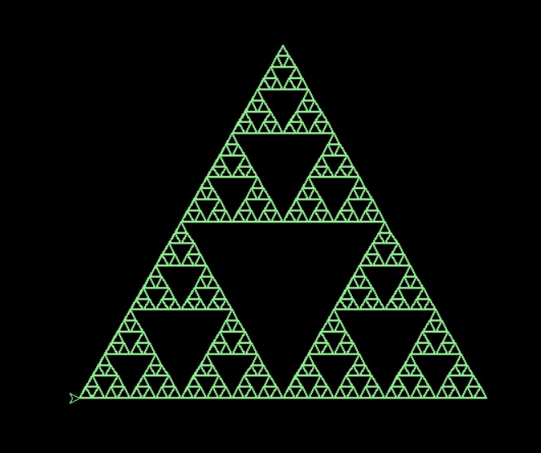

## توضیحات کد مثلث
<html>
<head>
    <h1 style=" color:blue; text-align:center;">توضیحات کد مثلث</h1>
    <body>
    
     
    

    
این کد یک برنامه پایتون است که از کتابخانه turtle برای رسم یک فرکتال استفاده می‌کند. بیایید مرحله به مرحله آن را توضیح دهیم:

1. وارد کردن کتابخانه `turtle`: 
   این خط کتابخانه turtle را وارد می‌کند که ابزارهایی برای رسم گرافیکی ارائه می‌دهد.

2. تعریف تابع `fractal`:
   این تابع برای رسم فرکتال با استفاده از روش بازگشتی تعریف شده است. دو پارامتر دارد: size که اندازه هر ضلع فرکتال را تعیین می‌کند و depth که عمق بازگشتی فرکتال را مشخص می‌کند.

3. شرط بازگشتی:
   اگر depth برابر با صفر باشد، یک مثلث متساوی الاضلاع رسم می‌کند. این پایه ساده‌ترین شکل فرکتال است.

4. بخش بازگشتی:
   اگر depth بیشتر از صفر باشد، تابع به صورت بازگشتی خودش را با عمق کمتر و اندازه نصف فراخوانی می‌کند. این کار ساختار فرکتالی را ایجاد می‌کند.

5. تنظیمات اولیه `turtle`:
   این قسمت سرعت، رنگ پس‌زمینه، موقعیت اولیه، ضخامت خط و رنگ قلم turtle را تنظیم می‌کند.

6. فراخوانی تابع `fractal` و نمایش نهایی:
   در اینجا، تابع fractal با اندازه 400 و عمق 5 فراخوانی می‌شود که یک فرکتال پیچیده را رسم می‌کند. سپس با استفاده از turtle.mainloop(), پنجره باز نگه داشته می‌شود تا کاربر بتواند فرکتال را مشاهده کند.

این کد یک نمونه زیبا از چگونگی استفاده از بازگشت و گرافیک برای خلق آثار هنری ریاضی است.

    <h2 style=" color:blue; text-align:center;">کد مثلث</h2>
    <pre>import turtle
def fractal(size, depth):
    if depth == 0:
        for _ in range(3):
    
            turtle.forward(size)
            turtle.left(120)

    else:
        size /= 2
        fractal(size, depth - 1)
        turtle.forward(size)
        fractal(size, depth - 1)
        turtle.backward(size)
        turtle.left(60)
        turtle.forward(size)
        turtle.right(60)
        fractal(size, depth - 1)
        turtle.left(60)
        turtle.backward(size)
        turtle.right(60)

turtle.speed(0)
turtle.bgcolor('black')
turtle.penup()
turtle.goto(0, -150)
turtle.pendown()
turtle.pensize(2)
turtle.pencolor('light green')

fractal(400, 5)
turtle.mainloop()
    </pre>
    <a href="tree.html">کد درخت</a>
    

    </body>
</head>
</html>
---
**Test**: This is atest
