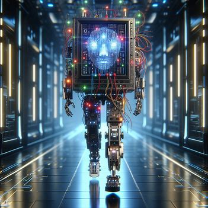

<html lang="en">
<head>
    <meta charset="UTF-8">
    <meta name="viewport" content="width=device-width, initial-scale=1.0">
    <title>Bing Image Creator Results</title>
    
</head>
<body>

در این قسمت با استفاده از سایت bing.com در قسمت هوش مصنوعی خواستم که یک دختر با مشخصاتی که دادم در حال کد زدن رسم کند و نتایج به این صورت شد :

<ul>
    <li></li>
    <li></li>
    <li></li>
    <li></li>
</ul>

برای نمونه های بیشتر از بینگ خواستم که ایران کنونی را به سبک ایران باستان و هخوامنشی ترسیم کند و نتایج به این صورت شد:
 

<ul>
    <li></li>
    <li></li>
    <li></li>
    <li></li>
</ul>

برای یک نمونه دیگر از بینگ خواستم که ایران را در دوره صفویه ترسیم کند و نتایج به این صورت شد:
 

<ul>
    <li></li>
    <li></li>
    <li></li>
    <li></li>
</ul>

در اینجا از هوش مصنوعی خواستم که یک کامپیوتر در حال راه رفتن و با صورت انسانی ترسیم کند . 
 

<ul>
    <li></li>
    <li></li>
    <li></li>
    <li></li>
</ul>

در اینجا نیز از هوش مصنوعی خواستم تا یک کوالا در حال کد زدن ترسیم کند که نتیجش به این صورت شد:
 

<ul>
    <li></li>
    <li></li>
    <li></li>
    <li></li>
</ul>

</body>
</html>
